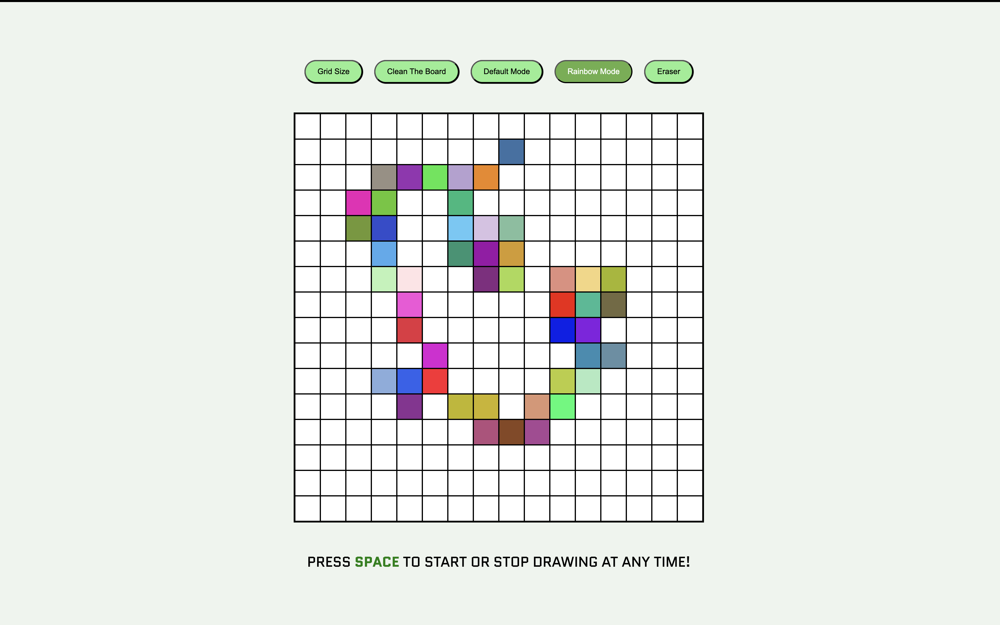

# Interactive Drawing Board (Etch-A-Sketch Clone)

# Description

This is an interactive browser-based drawing application built with HTML, CSS and vanilla JS as part of The Odin Project curriculum. It allows the user to draw in default or rainbow mode, which uses randomized RGB colors, adjust the grid size, erase cells, and clean the board.

# Live Demo

[Live Demo](https://cumhurbabaoglu.github.io/etch-a-sketch-project/)

# Features
- Rainbow drawing mode
- Default drawing mode
- Eraser
- Clean the board
- Switch on/off grid borders
- Dynamic grid generation
- Grid resizing (up to 100x100)
- Keyboard shortcut to start and pause drawing
- Different cursors for drawing and erasing
- Activated effect for mode buttons to show which buttons are being used

# Technologies Used

- HTML5
- CSS3
- JavaScript (ES6)

# What I Learned & Practiced

- DOM manipulation
- Event handling (keydown, click & mouseover)
- Event delegation
- Flag use to control switching between different modes

# Possible Improvements

- New color options for default mode (e.g., green, red, yellow etc.)
- Bigger eraser size for bigger grid sizes
- Replacing prompt and alerts with UI-based notifications
- Responsive design with media queries

# Screenshot

